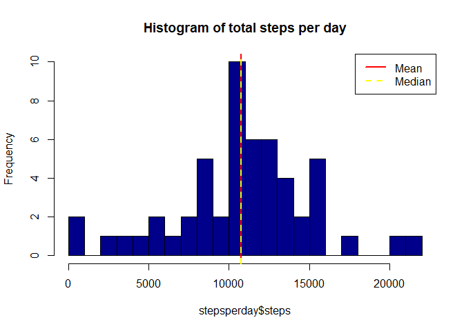
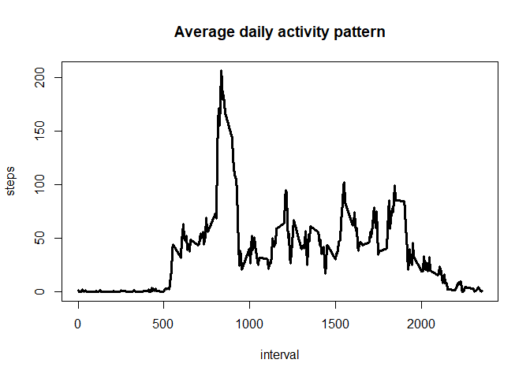
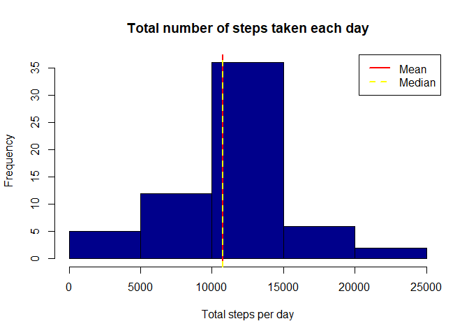
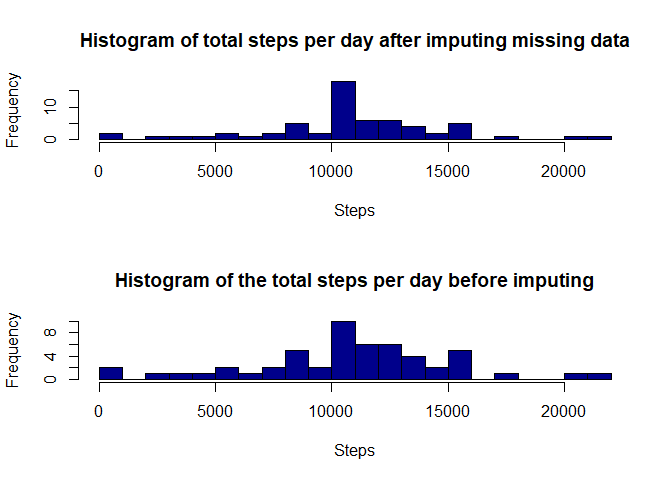

# Reproducible Research: Peer Assessment 1

## 0. Load packages


```r
packages <- c('ggplot2','dplyr','zoo','lubridate')
check_packages <- function (...) {
  lapply(list(...), function (p) {
     if (! p %in% installed.packages()) {
        install.packages(p)
        require(p,character.only=TRUE)
     }
  })
}
```


## 1. Load & preprocess data, remove NAs


```r
zipfilename <- "repdata%2Fdata%2Factivity.zip"
fileURL <- "https://d396qusza40orc.cloudfront.net/repdata%2Fdata%2Factivity.zip"

## Download and unzip the dataset:
if (!file.exists(zipfilename)){
  download.file(fileURL, dest=zipfilename)
  unzip (zipfilename)
}  

rawdata <- read.csv('activity.csv',header=TRUE,stringsAsFactors = FALSE,colClasses = c('numeric','Date','numeric'))

# check for NA's and omit rows with NA's
colSums(is.na(rawdata))    
```

```
##    steps     date interval 
##     2304        0        0
```

```r
actdata <- rawdata[complete.cases(rawdata$steps),]

# validate all NA's are removed 
colSums(is.na(actdata))
```

```
##    steps     date interval 
##        0        0        0
```

## 2. Compute total steps per day & plot histogram of total steps


```r
stepsperday <- aggregate(steps ~ date,data=actdata,FUN=sum)


hist(stepsperday$steps,main='Histogram of total steps per day',col='darkblue',breaks=20)
abline(v = mean(stepsperday$steps), lty = 1, lwd = 2, col = "red")
abline(v = median(stepsperday$steps), lty = 2, lwd = 2, col = "yellow")
legend(x = "topright", c("Mean", "Median"), col = c("red", "yellow"), 
       lty = c(1, 2), lwd = c(2, 2))
```

<!-- -->


## 3. Compute mean & median number of steps taken per day


```r
mean(stepsperday$steps)
```

```
## [1] 10766.19
```

```r
median(stepsperday$steps)
```

```
## [1] 10765
```


## 4. Plot average daily steps pattern using time series plot


```r
plot(aggregate(steps ~ interval,data=actdata,FUN=mean),type='l',main='Average daily activity pattern',lwd=3)
```

<!-- -->


## 5. Identify the 5 min interval with maximum number of steps


```r
stepsperinterval <- aggregate(steps ~ interval,actdata,mean)
stepsperinterval[which.max(stepsperinterval$steps),]
```

```
##     interval    steps
## 104      835 206.1698
```

The interval 835 is seen to have maximum number of average steps at 206


### identify number of missing values: output below shows 13% missing values for steps 


```r
colSums((is.na(rawdata)))
```

```
##    steps     date interval 
##     2304        0        0
```

```r
pmiss <- function (x) {sum(is.na(x))/length(x)*100}
apply(rawdata,2,pmiss)
```

```
##    steps     date interval 
## 13.11475  0.00000  0.00000
```

```r
#aggr_plot <- aggr(rawdata, col=c('navyblue','red'), numbers=TRUE, sortVars=TRUE, #labels=names(data), cex.axis=.7, gap=3, ylab=c("Histogram of missing data","Pattern"))
```


## 6. Imputing missing values with average per interval

strategy: Will use average steps per interval to impute for any missing values by interval. 

First add an indicator to show whether the row has missing or imputed data (NA's), compute avg steps per interval and use it for missing data matching by interval  


```r
# add column indicating imputed 'yes'| 'no'

rawdata$imputed <- ifelse(is.na(rawdata$steps),'yes','no') 

# fill in values for missing data with imputed data

imputed_data <- transform(rawdata, steps = ifelse(is.na(rawdata$steps),stepsperinterval$steps[match(rawdata$interval,stepsperinterval$interval)],rawdata$steps))

# compute sum of steps by date

steps_imputed <- aggregate(steps ~ date, imputed_data, sum)

# plot histogram with full data

hist(steps_imputed$steps, col = "darkblue", xlab = "Total steps per day",main = "Total number of steps taken each day")
abline(v = mean(steps_imputed$steps), lty = 1, lwd = 2, col = "red")
abline(v = median(steps_imputed$steps), lty = 2, lwd = 2, col = "yellow")
legend(x = "topright", c("Mean", "Median"), col = c("red", "yellow"), 
       lty = c(1, 2), lwd = c(2, 2))
```

<!-- -->


```r
mean(steps_imputed$steps)
```

```
## [1] 10766.19
```

```r
median(steps_imputed$steps)
```

```
## [1] 10766.19
```


## 7. Histogram showing total number of steps before and after adding imputed data


```r
library(dplyr)
```

```
## 
## Attaching package: 'dplyr'
```

```
## The following objects are masked from 'package:stats':
## 
##     filter, lag
```

```
## The following objects are masked from 'package:base':
## 
##     intersect, setdiff, setequal, union
```

```r
library(ggplot2)

# add indicator showing weekend or weekday for each row
imputed_data$weekday <- ifelse(weekdays(imputed_data$date) %in% c('Saturday','Sunday'),'weekend','weekday') 


sum_mean_median <- imputed_data %>% group_by(date) %>% summarise(sumsteps = sum(steps), meansteps = mean(steps), mediansteps = median(steps))

sum_mean_median
```

```
## # A tibble: 61 x 4
##          date sumsteps meansteps mediansteps
##        <date>    <dbl>     <dbl>       <dbl>
##  1 2012-10-01 10766.19  37.38260    34.11321
##  2 2012-10-02   126.00   0.43750     0.00000
##  3 2012-10-03 11352.00  39.41667     0.00000
##  4 2012-10-04 12116.00  42.06944     0.00000
##  5 2012-10-05 13294.00  46.15972     0.00000
##  6 2012-10-06 15420.00  53.54167     0.00000
##  7 2012-10-07 11015.00  38.24653     0.00000
##  8 2012-10-08 10766.19  37.38260    34.11321
##  9 2012-10-09 12811.00  44.48264     0.00000
## 10 2012-10-10  9900.00  34.37500     0.00000
## # ... with 51 more rows
```

```r
par(mfcol = c(2,1))

hist(sum_mean_median$sumsteps, main = "Histogram of total steps per day after imputing missing data", xlab = "Steps", breaks = 16, col = "darkblue")
hist(stepsperday$steps, main = "Histogram of the total steps per day before imputing", xlab = "Steps", breaks = 16, col = "darkblue")
```

<!-- -->

## 8.Panel plot comparing average number of steps per 5 minute interval across weekdays and weekend


```r
average_steps_state <- group_by(imputed_data, weekday, interval) %>%
    summarise(average_steps = mean(steps))
str(average_steps_state)
```

```
## Classes 'grouped_df', 'tbl_df', 'tbl' and 'data.frame':	576 obs. of  3 variables:
##  $ weekday      : chr  "weekday" "weekday" "weekday" "weekday" ...
##  $ interval     : num  0 5 10 15 20 25 30 35 40 45 ...
##  $ average_steps: num  2.251 0.445 0.173 0.198 0.099 ...
##  - attr(*, "vars")= chr "weekday"
##  - attr(*, "drop")= logi TRUE
```

```r
ggplot(average_steps_state, aes(x = interval, y = average_steps)) +
    geom_line() + 
    facet_grid(weekday ~ .) + 
    labs(x = "Interval") + 
    labs(y = "Number of steps")
```

<!-- -->

